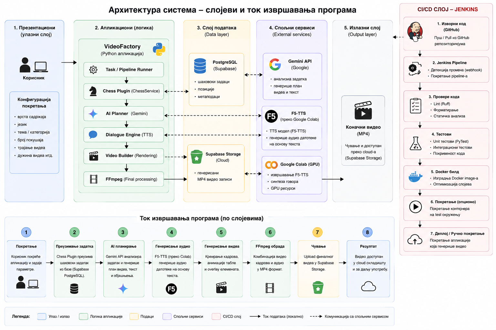

Naravno. Izbacio bih stvari koje nisu ključne za predstavljanje projekta, a README bih više usmerio na **cloud arhitekturu, automatizaciju, AI generisanje i CI**, pošto je to sada bitan deo diplomskog rada.

Evo kompletne verzije koju možeš direktno da staviš kao `README.md`:

# 🎬 VideoFactory

**VideoFactory** is a modular cloud-oriented system for automated generation of short-form multimedia content.

The system combines AI-generated content, chess puzzle processing, automated audio and video generation, cloud services, containerization, and CI automation into a single processing pipeline.

The project is designed around a modular architecture that allows additional content-generation plugins and processing components to be added without changing the core pipeline.

---

## 🚀 Overview

The main goal of VideoFactory is to automate the complete process of generating a short-form video.

A typical generation pipeline consists of:

```text
Chess Puzzle
     ↓
AI Content Generation
     ↓
Video Plan
     ↓
Text-to-Speech
     ↓
Chess Rendering
     ↓
Audio Synchronization
     ↓
FFmpeg Processing
     ↓
Final MP4 Video
```

The generated content can be processed using both local and cloud resources, allowing computationally demanding components to be separated from the main application.

---

# 🧱 Architecture

The application follows a modular architecture divided into several logical layers.



The architecture is organized into presentation, application, data, external service, and output layers. The main application logic is implemented within the VideoFactory Python application, while external cloud services provide persistent storage, AI processing, and cloud-based text-to-speech capabilities.

The main processing flow starts with retrieving a chess puzzle from the Supabase PostgreSQL database. The application then uses Google Gemini to generate the video plan and F5-TTS running in Google Colab to generate speech audio. The generated audio and chess data are passed to the video-generation pipeline, where the video frames, overlays, and audio are combined using FFmpeg.

The final MP4 video is uploaded to Supabase Storage, making the generated content available independently of the local execution environment.

# ☁️ Cloud Architecture

Cloud services are used to separate application logic from infrastructure-dependent resources.

### Supabase

Supabase provides the PostgreSQL database used for storing application data such as chess puzzles and information required during video generation.

### Google Colab

Google Colab is used as a cloud GPU environment for computationally demanding AI and text-to-speech processing.

This allows the main application to remain lightweight while expensive processing can be executed on remote computing resources.

### Local / Containerized Application

The main VideoFactory application can be packaged into a Docker container. This provides a reproducible runtime environment and simplifies deployment and execution.

---

# 🤖 AI Content Generation

Google Gemini is used as the AI component responsible for generating the structure and textual content of the video.

The AI generates information such as:

- video title
- introduction
- dialogue
- video pacing
- timeline elements
- ending content

The generated response is validated using Pydantic models before being passed to the rendering pipeline.

This ensures that AI-generated data follows the structure expected by the application.

---

# ♟️ Chess Processing

The chess plugin uses `python-chess` for processing chess positions and moves.

The system supports:

- FEN position parsing
- chess move validation
- game-state simulation
- move detection
- captures
- checks
- castling

Chess puzzles are retrieved from the PostgreSQL database and passed through the content-generation pipeline.

The plugin architecture allows chess-specific functionality to remain separated from the core video-generation system.

---

# 🎬 Video Generation

The video-generation pipeline combines generated content, chess rendering and audio into a final vertical video.

The rendering process includes:

- chessboard rendering
- dynamic text overlays
- video titles
- puzzle ratings
- timers
- move animations
- audio effects
- generated speech

Frames are streamed directly into FFmpeg instead of being stored individually as image files.

The final output is generated in a vertical format suitable for short-form platforms such as YouTube Shorts and TikTok.

---

# 🔊 Audio and TTS

The audio subsystem combines generated speech with chess-related sound effects.

Supported chess events include:

- move
- capture
- check
- castling

Audio events are synchronized using timestamps and combined with the generated video during the final FFmpeg processing stage.

The text-to-speech component is integrated as a separate infrastructure service, allowing the TTS implementation to be replaced without modifying the chess and video-generation logic.

---

# 🗄️ Database

The system uses PostgreSQL for persistent application data.

The database is used primarily for:

- storing chess puzzles
- retrieving puzzles for processing
- storing information required during generation
- maintaining application data used by the processing pipeline

The cloud database is provided through Supabase.

---

# 🐳 Docker

The application is containerized using Docker.

The Docker image contains the required Python dependencies and system dependencies such as FFmpeg.

This provides a consistent environment for:

- local development
- automated testing
- CI execution
- application execution

The same Docker image can therefore be used throughout the development and CI workflow.

---

# 🔄 Continuous Integration

The project contains a Jenkins CI pipeline that automatically verifies the application after changes are pushed to the GitHub repository.

The current CI pipeline consists of:

```text
Git Push
   ↓
GitHub
   ↓
Jenkins
   ↓
Checkout
   ↓
Docker Build
   ↓
Tests + Coverage
   ↓
Ruff Static Analysis
   ↓
SUCCESS
```

The pipeline executes the complete test suite inside the Docker environment.

The project currently contains unit and integration tests executed using `pytest`.

Code coverage is measured using `pytest-cov`.

Static code analysis is performed using `Ruff`.

This ensures that changes are automatically checked before they are considered valid.

---

# 🧪 Testing

The project contains both unit and integration tests.

Tests cover important components including:

- AI content generation
- pipeline execution
- plugin loading
- chess processing
- video planning
- TTS
- URL provider
- voice registry
- video generation components

The current test suite contains **47 tests**.

Example:

```bash
docker run --rm videofactory python3.11 -m pytest
```

Coverage can be generated with:

```bash
docker run --rm videofactory python3.11 -m pytest --cov=. --cov-report=term-missing
```

The current coverage is approximately **75%**.

---

# 🔍 Code Quality

Ruff is used for static analysis and code-quality checks.

Run locally with:

```bash
docker run --rm videofactory ruff check .
```

The same check is executed as part of the Jenkins CI pipeline.

---

# 📁 Project Structure

```text
VideoFactory/
│
├── app/
│   └── main.py
│
├── core/
│   ├── pipeline/
│   └── plugin_system/
│
├── infrastructure/
│   ├── db/
│   └── tts/
│
├── plugins/
│   └── chess/
│       ├── audio/
│       ├── content_generation/
│       ├── dto/
│       ├── repository/
│       ├── service/
│       └── video/
│
├── tests/
│   ├── unit/
│   └── integration/
│
├── ci_cd/
│   ├── Dockerfile
│   ├── Jenkinsfile
│   └── docker-compose.yml
│
├── requirements.txt
└── README.md
```

---

# ⚙️ Requirements

The project requires:

- Python 3.11+
- Docker
- FFmpeg
- PostgreSQL / Supabase
- Google Gemini API key
- TTS service configuration

For CI execution:

- Jenkins
- GitHub repository
- Docker access from Jenkins

---

# 🔐 Environment Variables

Create a `.env` file containing the required configuration.

Example:

```env
GEMINI_API_KEY=your_gemini_api_key
DATABASE_URL=your_database_url
MY_TTS_CHANNEL=your_tts_channel
```

Do not commit the `.env` file or API keys to the repository.

---

# ▶️ Running with Docker

Build the application image:

```bash
docker build -f ci_cd/Dockerfile -t videofactory .
```

Run the application:

```bash
docker run --rm -it --env-file .env videofactory python3.11 -m app.main
```

Run the test suite:

```bash
docker run --rm videofactory python3.11 -m pytest
```

Run coverage:

```bash
docker run --rm videofactory python3.11 -m pytest --cov=. --cov-report=term-missing
```

Run static analysis:

```bash
docker run --rm videofactory ruff check .
```

---

# 📊 Current CI Status

The project currently includes:

| Component                            | Status |
| ------------------------------------ | ------ |
| Modular architecture                 | ✅     |
| Chess processing                     | ✅     |
| AI content generation                | ✅     |
| TTS integration                      | ✅     |
| Automated video generation           | ✅     |
| PostgreSQL / Supabase                | ✅     |
| Docker                               | ✅     |
| Unit tests                           | ✅     |
| Integration tests                    | ✅     |
| Code coverage                        | ✅     |
| Ruff static analysis                 | ✅     |
| Jenkins CI                           | ✅     |
| Automated CD / production deployment | ⏳     |

Continuous deployment is intentionally not included because the current project does not use a permanent production environment.

---

# 🚧 Future Improvements

The architecture allows the system to be extended with:

- additional content-generation plugins
- additional multimedia formats
- additional AI providers
- dedicated cloud GPU infrastructure
- object storage for generated videos
- production deployment
- automated continuous deployment
- horizontal scaling of video-generation workers

---

# 📄 Project

**VideoFactory** is a university diploma project focused on the application of cloud computing, automation and modular software architecture to automated multimedia content generation.
